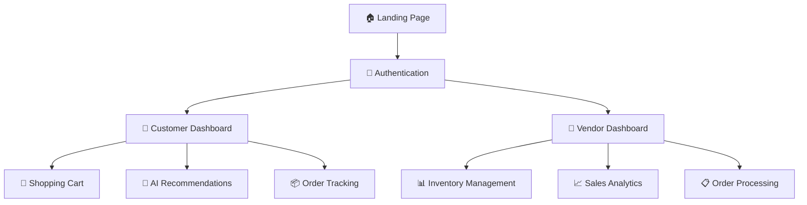
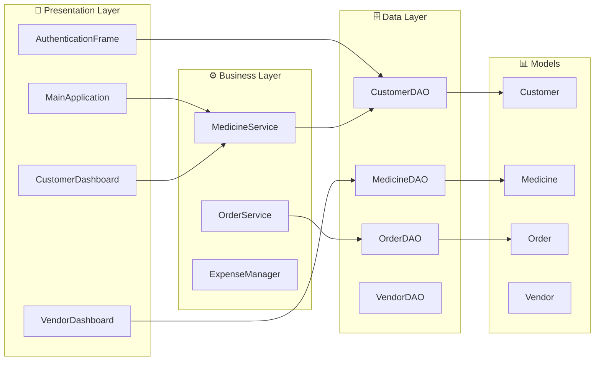
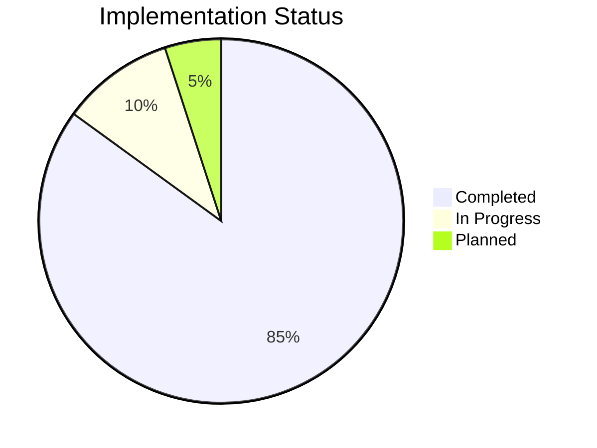

# 🏥 e-MEDpharma - Digital Pharmacy Management System

<div align="center">


**🚀 Revolutionizing healthcare through technology**

</div>

## 📋 Table of Contents
- [🎯 Overview](#-overview)
- [✨ Features](#-features)
- [🏗️ Architecture](#️-architecture)
- [🚀 Quick Start](#-quick-start)
- [🔐 Test Credentials](#-test-credentials)
- [📊 Project Structure](#-project-structure)
- [🛠️ Technologies](#️-technologies)

## 🎯 Overview

e-MEDpharma is a comprehensive digital pharmacy management system built with **Java Swing GUI**. It provides separate dashboards for customers and vendors with AI-powered recommendations, inventory management, and order processing.



## ✨ Features

### 👤 Customer Features
| Feature | Description | Status |
|---------|-------------|--------|
| 🤖 **AI Recommendations** | Smart medicine suggestions based on health patterns | ✅ |
| 🛒 **Shopping Cart** | Add/remove items with real-time management | ✅ |
| 📦 **Order Tracking** | View order history and track current orders | ✅ |
| 🔍 **Search** | Find medicines by name or category | ✅ |
| 📅 **Subscriptions** | Automated refill reminders | ✅ |
| 🏪 **Multi-Pharmacy** | Compare prices across vendors | ✅ |

### 🏪 Vendor Features
| Feature | Description | Status |
|---------|-------------|--------|
| 📊 **Inventory Management** | Add, edit, and track medicine stock | ✅ |
| 📋 **Order Processing** | Manage customer orders and fulfillment | ✅ |
| 📈 **Sales Analytics** | Business performance insights | ✅ |
| ⚠️ **Stock Alerts** | Low inventory notifications | ✅ |
| ⚙️ **Profile Management** | Vendor account settings | ✅ |

## 🏗️ Architecture



## 🚀 Quick Start

### Prerequisites
```bash
☑️ Java JDK 8+
☑️ MySQL Server (optional)
```

### 🎮 Run Application
```bash
# Method 1: Easy Launch
cd "Pharmacy-Drug-Mangement"
run.bat

# Method 2: Manual
cd "Pharmacy-Drug-Mangement/src"
javac -cp ".;*" com/emedpharma/gui/*.java
java com.emedpharma.gui.MainApplication
```

## 🔐 Test Credentials

<table>
<tr>
<th>👤 Customer Accounts</th>
<th>🏪 Vendor Account</th>
</tr>
<tr>
<td>

```
Username: aanchal01
Password: pass123

Username: shagun02  
Password: pass456

Username: dhara03
Password: pass789
```

</td>
<td>

```
Username: vendor01
Password: vendor123
```

</td>
</tr>
</table>

## 📊 Project Structure

```
📁 e-med pharma/
├── 📁 Pharmacy-Drug-Mangement/
│   ├── 📁 src/com/emedpharma/
│   │   ├── 🎨 gui/                    # User Interface
│   │   │   ├── 🏠 MainApplication.java
│   │   │   ├── 🔐 AuthenticationFrame.java
│   │   │   ├── 👤 SmartCustomerDashboard.java
│   │   │   └── 🏪 VendorDashboard.java
│   │   ├── 🗄️ dao/                    # Data Access
│   │   ├── 📊 model/                  # Data Models
│   │   └── ⚙️ service/               # Business Logic
│   └── 🚀 run.bat                    # Easy Launcher
├── 📸 Screenshots/                   # App Screenshots
├── 🗃️ drugdatabase.sql              # Database Schema
└── 📖 README.md                     # Documentation
```

## 🛠️ Technologies

<div align="center">

| Technology | Purpose | Version |
|------------|---------|---------|
| ☕ **Java** | Core Language | JDK 8+ |
| 🖼️ **Swing** | GUI Framework | Built-in |
| 🗄️ **MySQL** | Database | 8.0+ |
| 🏗️ **MVC** | Architecture Pattern | - |

</div>

## 📈 Features Status



## 🎨 UI Preview

<div align="center">

### 🏠 Landing Page


### 👤 Customer Dashboard  


### 🏪 Vendor Dashboard


</div>

## 🚀 Future Roadmap

- [ ] 👨‍💼 Admin Dashboard
- [ ] 📱 Mobile App Version  
- [ ] 💳 Payment Gateway Integration
- [ ] 🔔 Real-time Notifications
- [ ] 📊 Advanced Analytics
- [ ] 🤖 Enhanced AI Features

## 🤝 Contributing

1. Fork the repository
2. Create feature branch (`git checkout -b feature/AmazingFeature`)
3. Commit changes (`git commit -m 'Add AmazingFeature'`)
4. Push to branch (`git push origin feature/AmazingFeature`)
5. Open Pull Request

## 📄 License

This project is developed for **educational and demonstration purposes**.

---

<div align="center">

**🏥 e-MEDpharma** - *Empowering Health Through Technology*

[](https://github.com/yourusername/e-medpharma)

</div>